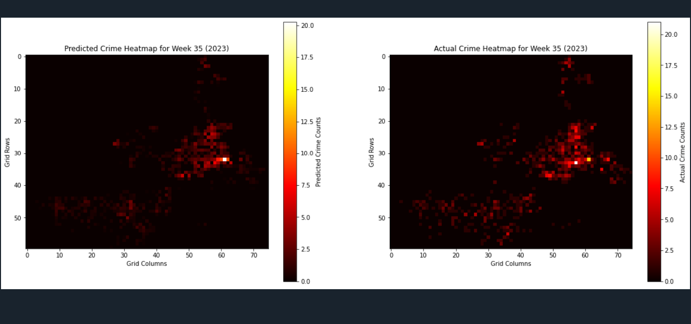
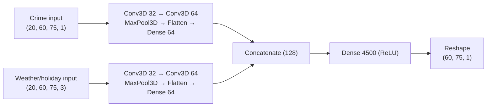

# LA Crime Prediction

> Forecast next-week violent-crime counts on a 60×75 LA grid from crime history plus weather and holidays. Reported val MAE ≈ 0.18.

A multimodal 3D CNN that forecasts next-week violent-crime counts on a 60×75 grid over Los Angeles. It takes two aligned inputs: 20 weeks of per-cell crime counts and 20 weeks of per-cell weather/holiday features (temperature, rain, is_holiday). Each branch is a stack of 3D convolutions; the branches are concatenated and mapped to 4,500 outputs, reshaped back to the 60×75 grid. Training and evaluation in this repo use 2023 weekly grids: 52 weeks, sliced into 32 sliding windows, split 80/20 by time.

## Results

Reported validation numbers from the training run documented in this repo (`neural_network_training.py`, 50 epochs, batch 8, Adam 0.001).

| Metric | Value | Notes |
| --- | --- | --- |
| MAE | ≈ 0.175 | Crimes per grid cell per week, validation split |
| MSE | 0.377 | Training loss function, validation split |
| RMSE | ≈ 0.61 | Against a mean of ~0.56 crimes per cell in the 2023 grid |

Errors are on the same scale as the signal. RMSE ≈ 0.61 versus a ~0.56 mean means the model is useful for relative hotspot structure, not for exact counts in any single cell.



## Architecture



## Stack

Python, TensorFlow/Keras, pandas, numpy, matplotlib.

## Clone

```bash
git clone https://github.com/DannyBarren/LA_Crime_Prediction.git
cd LA_Crime_Prediction
```

## Train

The training script expects `crime_counts_2023.csv` (4500 × 52) and `weather_holiday_2023.csv` (4500 × 156) in the working directory. Those CSVs are not in this repo, so you must supply them locally.

```bash
pip install -r requirements.txt
python neural_network_training.py
```

The run writes `crime_prediction_model.h5`.

## Demo the heatmaps

The demo script expects a local `crime_prediction_model.h5` plus the same two CSVs. It prompts for a week between 21 and 52 and draws predicted and actual heatmaps side by side.

```bash
python model_test_application.py
```

## Data

Public LAPD incident data and National Weather Service station data, aggregated into weekly 60×75 grid tensors off-repo. Sources by name:

- Los Angeles Open Data — LAPD crime incident data
- NOAA / National Weather Service — climate and station observations

This repo does not ship the CSVs or the trained weights. The aggregation code lives outside this repo.

## Limitations

- One year of weekly grids. 52 weeks becomes 32 sliding windows, and only 7 of them are validation.
- No socio-economic, land-use, or event features. Weather, holiday, and crime history only.
- No normalization of the input tensors; raw counts and weather values go straight in.
- Prototype. Not a deployment, not calibrated, not audited.

## What this is evidence of

- Building a multimodal 3D CNN with two input branches in TensorFlow/Keras.
- Framing a spatiotemporal forecast as a supervised regression over a fixed grid.
- Using a time-based split so no future week leaks into training.
- Reporting error on a scale that can be compared to the data (MAE against mean counts per cell).
- Visual validation: predicted versus actual heatmaps for a held-out week.

## License

MIT. See [LICENSE](LICENSE).
